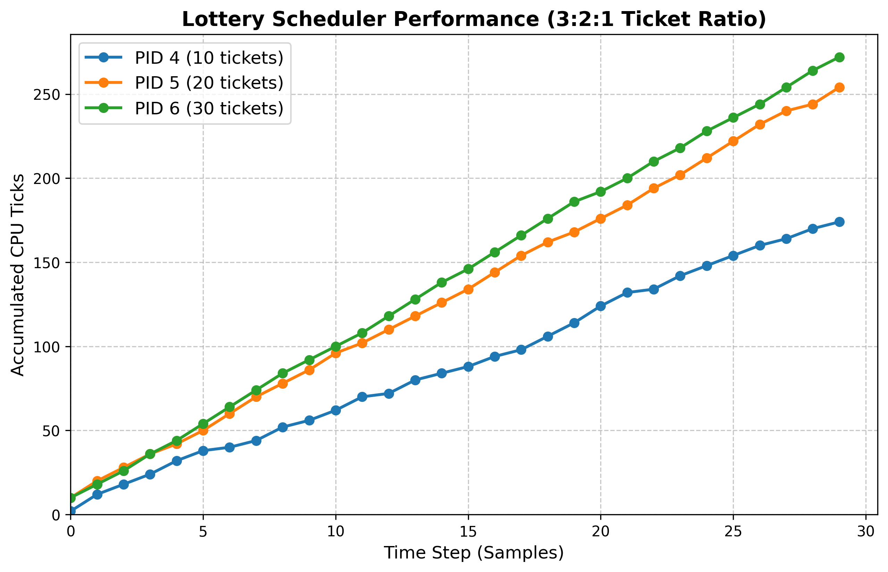

# Kernel Hacking xv6 (risc)

This fork of xv6 works through the projects from OSTEP.

[Project Page](https://github.com/remzi-arpacidusseau/ostep-projects/tree/master)

# 1: Adding a Syscall

The first assignment was to add a syscall to xv6. The syscall simply returns how many times a process has called the read() syscall.

To do this, we register the syscall number, add a field for read_count in the proc structure, and

- in sys_read(), before returning on success, increment the read_count field in the process
- sys_readcount() simply returns the process's current count.

Then, a test in userspace was added (and the syscall registered), and can be checked with

```bash
./test-xv6.py countread
```

# 2: Implementing a Scheduler

Here, we implement a lottery scheduler.

First, the logic for the lottery scheduler is implemented in proc.c. To do this, we essentially just follow the specifications from the book.

Next, we implement the settickets system call. Here we add a field in the proc struct to hold the number of tickets. Then, we simply update this.

For the getpinfo system call we do the following:

- add a ticks field to the proc struct, and on any timer interrupt, the currently running process' tick count is incremented.
- when getpinfo is called, we populate the passed in pstat struct where
    - any unused struct from the existing proc table, we say the slot is unused
    - for used slots, we get the all the info from the proc itself and populate pstat
    - lastly, copy out the data to user space

Then, following the same steps from the first assignment for registering / adding system cals, we set up registration in both the kernel and in user space.

Lastly, we create a simple userspace program that

1. assigns 100 tickets to the main parent (so that it can print)
2. forks three times, assigning 10, 20, 30 tickets respectively (also saving the pids so that they can be killed later)
3. each forked program just infinitely loops
4. print stats 30 times, waiting 5 tickets in between each print

We then consolidate the data and create a graph to see the ticket usage over time and confirm that the lottery scheduler is working as expected


